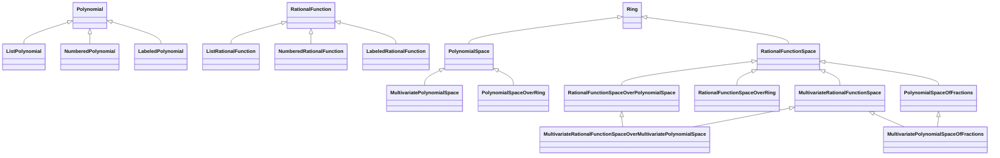

# Polynomials and Rational Functions

KMath provides a way to work with uni- and multivariate polynomials and rational functions. It includes full support of arithmetic operations of integers, **constants** (elements of ring polynomials are build over), variables (for certain multivariate implementations), polynomials and rational functions encapsulated in so-called **polynomial space** and **rational function space** and some other utilities such as algebraic differentiation and substitution.

## Concrete realizations

There are 3 approaches to represent polynomials:
1. For univariate polynomials one can represent and store polynomial as a list of coefficients for each power of the variable. I.e. polynomial  $a_0 + \dots + a_n x^n $ can be represented as a finite sequence $(a_0; \dots; a_n)$. (Compare to sequential definition of polynomials.)
2. For multivariate polynomials one can represent and store polynomial as a matching (in programming it is called "map" or "dictionary", in math it is called [functional relation](https://en.wikipedia.org/wiki/Binary_relation#Special_types_of_binary_relations)) of each "**term signature**" (that describes what variables and in what powers appear in the term) with corresponding coefficient of the term. But there are 2 possible approaches of term signature representation:
   1. One can number all the variables, so term signature can be represented as a sequence describing powers of the variables. I.e. signature of term  $c \\; x_0^{d_0} \dots x_n^{d_n} $ (for natural or zero  $d_i $) can be represented as a finite sequence  $(d_0; \dots; d_n)$.
   2. One can represent variables as objects ("**labels**"), so term signature can be also represented as a matching of each appeared variable with its power in the term. I.e. signature of term  $c \\; x_0^{d_0} \dots x_n^{d_n} $ (for natural non-zero  $d_i $) can be represented as a finite matching  $(x_0 \to d_1; \dots; x_n \to d_n)$.

All that three approaches are implemented by "list", "numbered", and "labeled" versions of polynomials and polynomial spaces respectively. Whereas all rational functions are represented as fractions with corresponding polynomial numerator and denominator, and rational functions' spaces are implemented in the same way as usual field of rational numbers (or more precisely, as any field of fractions over integral domain) should be implemented.

So here are a bit of details. Let `C` by type of constants. Then:
1. `ListPolynomial`, `ListPolynomialSpace`, `ListRationalFunction` and `ListRationalFunctionSpace` implement the first scenario. `ListPolynomial` stores polynomial  $a_0 + \dots + a_n x^n $ as a coefficients list `listOf(a_0, ..., a_n)` (of type `List<C>`).
  
   They also have variation `ScalableListPolynomialSpace` that replaces former polynomials and implements `ScaleOperations`.
2. `NumberedPolynomial`, `NumberedPolynomialSpace`, `NumberedRationalFunction` and `NumberedRationalFunctionSpace` implement second scenario. `NumberedPolynomial` stores polynomials as structures of type `Map<List<UInt>, C>`. Signatures are stored as `List<UInt>`. To prevent ambiguity signatures should not end with zeros.
3. `LabeledPolynomial`, `LabeledPolynomialSpace`, `LabeledRationalFunction` and `LabeledRationalFunctionSpace` implement third scenario using common `Symbol` as variable type. `LabeledPolynomial` stores polynomials as structures of type `Map<Map<Symbol, UInt>, C>`. Signatures are stored as `Map<Symbol, UInt>`. To prevent ambiguity each signature should not map any variable to zero.

### Example: `ListPolynomial`

For example, polynomial  $2 - 3x + x^2 $ (with `Int` coefficients) is represented
```kotlin
val polynomial: ListPolynomial<Int> = ListPolynomial(listOf(2, -3, 1))
// or
val polynomial: ListPolynomial<Int> = ListPolynomial(2, -3, 1)
```

All algebraic operations can be used in corresponding space:
```kotlin
val computationResult = Int.algebra.listPolynomialSpace {
   ListPolynomial(2, -3, 1) + ListPolynomial(0, 6) == ListPolynomial(2, 3, 1)
}

println(computationResult) // true
```

For more see [examples](../examples/src/main/kotlin/space/kscience/kmath/functions/polynomials.kt).

### Example: `NumberedPolynomial`

For example, polynomial  $3 + 5 x_1 - 7 x_0^2 x_2 $ (with `Int` coefficients) is represented
```kotlin
val polynomial: NumberedPolynomial<Int> = NumberedPolynomial(
   mapOf(
      listOf<UInt>() to 3,
      listOf(0u, 1u) to 5,
      listOf(2u, 0u, 1u) to -7,
   )
)
// or
val polynomial: NumberedPolynomial<Int> = NumberedPolynomial(
   listOf<UInt>() to 3,
   listOf(0u, 1u) to 5,
   listOf(2u, 0u, 1u) to -7,
)
```

All algebraic operations can be used in corresponding space:
```kotlin
val computationResult = Int.algebra.numberedPolynomialSpace {
   NumberedPolynomial(
      listOf<UInt>() to 3,
      listOf(0u, 1u) to 5,
      listOf(2u, 0u, 1u) to -7,
   ) + NumberedPolynomial(
      listOf(0u, 1u) to -5,
      listOf(0u, 0u, 0u, 4u) to 4,
   ) == NumberedPolynomial(
      listOf<UInt>() to 3,
      listOf(0u, 1u) to 0,
      listOf(2u, 0u, 1u) to -7,
      listOf(0u, 0u, 0u, 4u) to 4,
   )
}

println(computationResult) // true
```

For more see [examples](../examples/src/main/kotlin/space/kscience/kmath/functions/polynomials.kt).

### Example: `LabeledPolynomial`

For example, polynomial  $3 + 5 y - 7 x^2 z $ (with `Int` coefficients) is represented
```kotlin
val polynomial: LabeledPolynomial<Int> = LabeledPolynomial(
   mapOf(
      mapOf<Symbol, UInt>() to 3,
      mapOf(y to 1u) to 5,
      mapOf(x to 2u, z to 1u) to -7,
   )
)
// or
val polynomial: LabeledPolynomial<Int> = LabeledPolynomial(
   mapOf<Symbol, UInt>() to 3,
   mapOf(y to 1u) to 5,
   mapOf(x to 2u, z to 1u) to -7,
)
```

All algebraic operations can be used in corresponding space:
```kotlin
val computationResult = Int.algebra.labeledPolynomialSpace {
   LabeledPolynomial(
      listOf<UInt>() to 3,
      listOf(0u, 1u) to 5,
      listOf(2u, 0u, 1u) to -7,
   ) + LabeledPolynomial(
      listOf(0u, 1u) to -5,
      listOf(0u, 0u, 0u, 4u) to 4,
   ) == LabeledPolynomial(
      listOf<UInt>() to 3,
      listOf(0u, 1u) to 0,
      listOf(2u, 0u, 1u) to -7,
      listOf(0u, 0u, 0u, 4u) to 4,
   )
}

println(computationResult) // true
```

For more see [examples](../examples/src/main/kotlin/space/kscience/kmath/functions/polynomials.kt).

## Abstract entities (interfaces and abstract classes)



There are implemented `Polynomial` and `RationalFunction` interfaces as abstractions of polynomials and rational functions respectively (although, there is not a lot of logic in them) and `PolynomialSpace` and `RationalFunctionSpace` (that implement `Ring` interface) as abstractions of polynomials' and rational functions' spaces respectively. More precisely, that means they allow to declare common logic of interaction with such objects and spaces:
- `Polynomial` does not provide any logic. It is marker interface.
- `RationalFunction` provides numerator and denominator of rational function and destructuring declaration for them.
- `PolynomialSpace` provides all possible arithmetic interactions of integers, constants (of type `C`), and polynomials (of type `P`) like addition, subtraction, multiplication, and some others and common properties like degree of polynomial.
- `RationalFunctionSpace` provides the same as `PolynomialSpace` but also for rational functions: all possible arithmetic interactions of integers, constants (of type `C`), polynomials (of type `P`), and rational functions (of type `R`) like addition, subtraction, multiplication, division (in some cases), and some others and common properties like degree of polynomial.

Then to add abstraction of similar behaviour with variables (in multivariate case) there are implemented `MultivariatePolynomialSpace` and `MultivariateRationalFunctionSpace`. They just include variables (of type `V`) in the interactions of the entities.

Also, to remove boilerplates there were provided helping subinterfaces and abstract subclasses:
- `PolynomialSpaceOverRing` allows to replace implementation of interactions of integers and constants with implementations from provided ring over constants (of type `A: Ring<C>`).
- `RationalFunctionSpaceOverRing` &mdash; the same but for `RationalFunctionSpace`.
- `RationalFunctionSpaceOverPolynomialSpace` &mdash; the same but "the inheritance" includes interactions with polynomials from provided `PolynomialSpace`.
- `PolynomialSpaceOfFractions` is actually abstract subclass of `RationalFunctionSpace` that implements all fractions boilerplates with provided (`protected`) constructor of rational functions by polynomial numerator and denominator.
- `MultivariateRationalFunctionSpaceOverMultivariatePolynomialSpace` and `MultivariatePolynomialSpaceOfFractions` &mdash; the same stories of operators inheritance and fractions boilerplates respectively but in multivariate case.

## Utilities

For all kinds of polynomials there are provided (implementation details depend on kind of polynomials) such common utilities as:
1. differentiation and anti-differentiation,
2. substitution, invocation and functional representation.